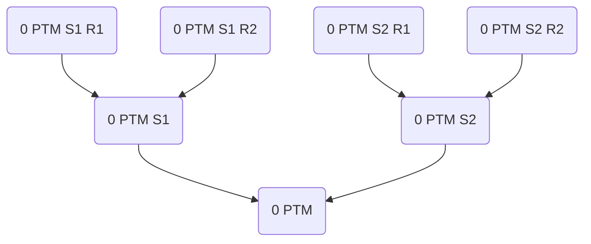
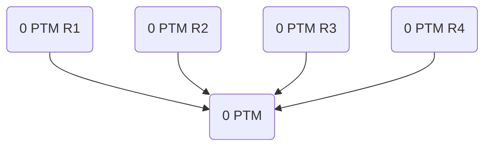

# DIANA


DIANA is a command line application for **d**ata **i**ntegration **a**nd
**n**etwork **a**nalysis for post-translational modification mass spectrometry
data.

DIANA automates modular analysis of differential post-translational modification
as captured by mass-spectrometry in the context of the protein-protein
interaction network assembled from multiple input data sets, incorporating
protein-protein interactions and neighboring proteins from
[BioGRID](https://thebiogrid.org/),
[CORUM](http://mips.helmholtz-muenchen.de/corum/),
[IntAct](https://www.ebi.ac.uk/intact/home),
[MINT](https://mint.bio.uniroma2.it/), [Reactome](https://reactome.org/), and
[STRING](https://string-db.org/).

Network analysis assesses the distribution of mass spectrometry measurements
across densely interacting communities of the protein-protein interaction
network as well as local enrichment of [Gene Ontology](http://geneontology.org/)
terms and [Reactome](https://reactome.org/) pathways indicating cellular
processes represented in these communities to determine individual groups of
associated proteins for separate downstream analysis as well as customizable
network visualization in [Cytoscape](https://cytoscape.org/) from mass
spectrometry data containing thousands of proteins.

While the pipeline is applicable to other proteomics data, its general approach
was developed primarily for the analysis of mass-spectrometry data covering
changes in post-translational modification of host proteins following infection
by different pathogens at distinct times of measurement to facilitate
examination of post-translational modification in connection to cellular
processes associated with host response.

## Setup
External dependencies, consisting of [NetworkX](https://networkx.org/),
[pandas](https://pandas.pydata.org/), and [SciPy](https://scipy.org/), can be
installed using pip by running the following command

```
pip3 install -r diana/requirements.txt
```

For input of mass-spectrometry data by spreadsheet, pandas dependencies may need
to be installed additionally.

DIANA is currently developed using Python 3.10.7, Ubuntu 22.10 and Cytoscape
3.9.1. Source code is formatted automatically using YAPF 0.32.0.

## Command Line Interface
Instructions can be displayed by running the following command:

```
python3 diana/diana.py --help
```

Configuration of workflows is detailed below. Examples of configuration files
for the analysis of published data sets referenced below are included in this
repository.

## Configuration
A workflow consists of the assembly of a protein-protein interaction network,
the detection of its densely interacting protein subsets and their statistical
analysis with respect to the distribution of mass-spectrometric measurements and
enrichment of Gene Ontology terms and Reactome pathways.


A configuration file contains pairs of identifier and workflow configuration
executed sequentially. Multiple configuration files are processed concurrently.
The identifier determines output file names. Therefore, identifiers should be
unique across configuration files.

Protein-protein interaction, Gene Ontology, and Reactome networks are exported
as GraphML files named according to their corresponding workflow identifier,
for example `configuration.graphml`, `configuration_gene_ontology.graphml`, and
`configuration_reactome.graphml`. File names of Cytoscape styles, exported as
XML files, match, for example `configuration.xml`,
`configuration_gene_ontology.xml`, and `configuration_reactome.xml`. Communities
of protein-protein interaction networks are indexed in descending order of the
number of proteins they contain, for example `configuration_1.graphml`.

Results of different statistical analyses are exported as separate TSV files,
for example `configuration_gene_ontology.tsv`, `configuration_reactome.tsv`,
`configuration_measurement_enrichment.tsv`, and
`configuration_measurement_location.tsv`.

Events during workflow execution are logged to `diana.log`, at a level specified
in the command line call, informing about attempted or completed tasks and
warning about file naming conflicts, indicating that workflows should be renamed
as they are not resolved. Existing files are not overwritten. Instead, the
export is omitted. Logs also contain the process ID of a workflow.

---

Proteins may be associated with multiple types of post-translational
modification each captured at multiple different relative times of measurement.

Analyses enable consideration of multiple different types of post-translational
modification measured at the same time while separating different times. For
example, enrichment analysis may consider a subset of proteins determined on the
basis of measurements for two different types of post-translational modification
but treat each time of measurement separately. Relative thresholds for
measurements refer to distributions for a particular type of post-translational
modification and time of measurement. Several options may be specified
separately for different types of post-translational modification but not
different times of measurement.

Several options for workflow customization invoke the nested representation of
post-translational modification mass spectrometry data implemented by DIANA and
support or require merging measurements.

Measurements are associated with specific modification sites along the protein
sequence for each of which there are typically multiple replicates. Therefore, a
site-specific representation requires averaging the corresponding replicates and
a protein-specific measurement representation requires averaging the
corresponding sites.



In the interest of supporting different averages and network analysis of
comparable quantitative proteomics data without site-specificity, the
organization of measurements by modification site is optional.



---

Input proteins are read from tabular input files. Networks output by previous
analysis can be used as input.

```json
{
  "configuration": {
    "PTM-MS": {
      "0": {
        "PTM": {
          "organism": 9606
        }
      }
    },
    "networks": [
      {
        "organism": 9606
      }
    ],
    "proteins": [
      {
        "organism": 9606
      }
    ]
  }
}
```
The NCBI taxonomy ID of the organism of interest. The default and currently only
completely supported setting is `9606`, corresponding to Homo sapiens.

```json
{
  "configuration": {
    "PTM-MS": {
      "0": {
        "PTM": {
          "file": null
        }
      }
    }
  }
}
```
The tabular input file with UniProt protein accessions and mass spectrometry
data.

```json
{
  "configuration": {
    "PTM-MS": {
      "0": {
        "PTM": {
          "accession column": null
        }
      }
    }
  }
}
```
The table column to extract UniProt protein accessions from. Accessions are
mapped to primary UniProt accessions or discarded if not present in Swiss-Prot.
Isoform identifiers are maintained on primary, but not transferred from
secondary accessions.

```json
{
  "configuration": {
    "PTM-MS": {
      "0": {
        "PTM": {
          "accession format": "^(.+)$"
        }
      }
    }
  }
}
```
A regular expression used to extract all matching protein accessions from a
spreadsheet cell entry in the table, possibly removing additional components of
the entry. The default setting is `"^(.+)$"`, corresponding to the entire entry.

```json
{
  "configuration": {
    "PTM-MS": {
      "0": {
        "PTM": {
          "sheet": 1
        }
      }
    }
  }
}
```
The spreadsheet from a file to extract input from. The default setting is `1`
corresponding to the first spreadsheet in the file.

```json
{
  "configuration": {
    "PTM-MS": {
      "0": {
        "PTM": {
          "header": 1
        }
      }
    }
  }
}
```
The line number of the header, allowing to skip preceding lines. The default
setting is `1`, corresponding to the first line of the sheet.

```json
{
  "configuration": {
    "PTM-MS": {
      "0": {
        "PTM": {
          "position column": null
        }
      }
    }
  }
}
```
The optional table column reporting modification sites of measurements,
according to which they are ordered. If an entry contains fewer positions than
measurements, missing modification sites are substituted by 0. If an entry
contains more positions than measurements, only as many leading entries as there
are measurements are used. If the column is not specified, measurements are
associated with the corresponding protein.

```json
{
  "configuration": {
    "PTM-MS": {
      "0": {
        "PTM": {
          "position format": "^(.+)$"
        }
      }
    }
  }
}
```
A regular expression used to extract matching modification sites from an entry
in the table, allowing to remove additions to the site number. The default
setting is `"^(.+)$"`, corresponding to the entire entry.

```json
{
  "configuration": {
    "PTM-MS": {
      "0": {
        "PTM": {
          "replicate columns": []
        }
      }
    }
  }
}
```
A list of columns to extract replicate measurements from. The default setting is
`[]`, resulting in no incorporation of proteins.

```json
{
  "configuration": {
    "PTM-MS": {
      "0": {
        "PTM": {
          "replicate format": "^(.+)$"
        }
      }
    }
  }
}
```
A regular expression used to extract matching replicate measurements from an
entry in the table, allowing to remove additions to the measurement. The default
setting is `"^(.+)$"`, corresponding to the entire entry.

```json
{
  "configuration": {
    "PTM-MS": {
      "0": {
        "PTM": {
          "replicates": 1
        }
      }
    }
  }
}
```
An inclusive threshold on the number of replicates required to consider a
measurement. The default setting is `1`.

```json
{
  "configuration": {
    "PTM-MS": {
      "0": {
        "PTM": {
          "sites": 5
        }
      }
    }
  }
}
```
The maximum number of measurements to associate with each protein prioritized by
largest absolute measurement. The default setting is `5`.

```json
{
  "configuration": {
    "PTM-MS": {
      "0": {
        "PTM": {
          "site prioritization": "absolute"
        }
      }
    }
  }
}
```
A function of a site-specific measurement to prioritize it over others. The
default setting is `"absolute"` corresponding to the absolute binary logarithm
weighting relative change in either direction equally. Available settings are
`"absolute"` as well as `"increase"`, and `"decrease"` to prioritize
measurements constituting either increase or decrease, respectively.

```json
{
  "configuration": {
    "PTM-MS": {
      "0": {
        "PTM": {
          "site order": "measurement"
        }
      }
    }
  }
}
```
A function of a site-specific measurement and its position to define the order
of sites. The default setting is `"measurement"` corresponding to the binary
logarithm ordering sites in ascending order. Available settings are
`"absolute measurement"`, `"measurement"`, and `"position"`.

```json
{
  "configuration": {
    "PTM-MS": {
      "0": {
        "PTM": {
          "replicate average": "mean"
        }
      }
    }
  }
}
```
The average of distinct replicates representing a single protein- or
modification site-specific measurement. The function is applied to ratios, not
their binary logarithm. Cytoscape styles refer to this average. The default
setting is `"mean"`. Available settings are `"mean"`, `"median"`, `"maximum"`,
`"maximum absolute logarithm"`, `"minimum"`, `"minimum absolute logarithm"`,
`"sum"`, and `"sum absolute logarithm"`.

```json
{
  "configuration": {
    "PTM-MS": {
      "0": {
        "PTM": {
          "logarithm": null
        }
      }
    }
  }
}
```
The base of the logarithm that measurements are reported as. By default, ratios
are assumed and no score is performed, corresponding to `null`. Available
settings are `null`, `2` and `10`.

```json
{
  "configuration": {
    "networks": [
      {
        "network": null
      }
    ]
  }
}
```
A list of protein-protein interaction networks as exported, allowing to resume,
modify or narrow analyses from previous workflows. The union of nodes in input
protein-protein interaction networks and input proteins is used.

```json
{
  "configuration": {
    "proteins": [
      {
        "accessions": []
      }
    ]
  }
}
```
A list of UniProt protein accessions to add to the protein-protein interaction
network. Accessions are mapped to primary UniProt accessions or discarded if not
present in Swiss-Prot. Isoform identifiers are maintained on primary, but not
transferred from secondary accessions.

---

The interface to sources of protein-protein interactions for the protein-protein
interaction network. The protein-protein interaction network is exported only if
any source is queried. Database-specific requirements can be defined, where
each must be satisfied for an interaction to be incorporated. Notably, this
also applies to STRING scores by default.

```json
{
  "configuration": {
    "protein-protein interactions": {
      "BioGRID": {
        "neighbors": 0
      },
      "CORUM": {
        "neighbors": 0
      },
      "IntAct": {
        "neighbors": 0
   },
      "MINT": {
        "neighbors": 0
      },
      "Reactome": {
        "neighbors": 0
      },
      "STRING": {
        "neighbors": 0
      }
    }
  }
}
```
An integer specifying the extension of the network using species-specific
proteins which are separated by up to `"neighbors"` protein-protein interactions
from the input proteins in the corresponding database. The default setting is
`0`, corresponding to no extension.

```json
{
  "configuration": {
    "protein-protein interactions": {
      "BioGRID": {
        "organism": 9606
      },
      "CORUM": {
        "organism": 9606
      },
      "IntAct": {
        "organism": 9606
      },
      "MINT": {
        "organism": 9606
      },
      "Reactome": {
        "organism": 9606
      },
      "STRING": {
        "organism": 9606
      }
    }
  }
}
```
The NCBI taxonomy ID for the organism of interest. The default and currently
only completely supported setting is `9606`, corresponding to Homo sapiens.


```json
{
  "configuration": {
    "protein-protein interactions": {
      "BioGRID": {
        "interaction throughput": []
      }
    }
  }
}
```
A list of accepted interaction throughput annotations. The default setting is
`[]`, corresponding to any annotation.

```json
{
  "configuration": {
    "protein-protein interactions": {
      "BioGRID": {
        "experimental system": []
      }
    }
  }
}
```
A list of accepted experimental system annotations. The default setting is `[]`,
corresponding to any annotation.

```json
{
  "configuration": {
    "protein-protein interactions": {
      "BioGRID": {
        "experimental system type": []
      }
    }
  }
}
```
A list of accepted experimental system type annotations. The default setting is
`[]`, corresponding to any annotation.

```json
{
  "configuration": {
    "protein-protein interactions": {
      "BioGRID": {
        "multi-validated physical": false
      }
    }
  }
}
```
If `true`, restrict query to multi-validated physical protein-protein
interactions. The default setting is `false`.

```json
{
  "configuration": {
    "protein-protein interactions": {
      "BioGRID": {
        "version": null
      }
    }
  }
}
```
The version of the BioGRID database to query. The default setting is `null`,
corresponding to the latest version.

```json
{
  "configuration": {
    "protein-protein interactions": {
      "CORUM": {
        "purification methods": []
      }
    }
  }
}
```
A list of accepted PSI-MI identifiers or terms for protein complex purification
methods. The default setting is `[]`, corresponding to any annotation.

```json
{
  "configuration": {
    "protein-protein interactions": {
      "IntAct": {
        "interaction detection methods": []
      },
      "MINT": {
        "interaction detection methods": []
      }
    }
  }
}
```
A list of accepted PSI-MI identifiers or terms for interaction detection
methods. The default setting is `[]`, corresponding to any annotation.

```json
{
  "configuration": {
    "protein-protein interactions": {
      "IntAct": {
        "interaction types": []
      },
      "MINT": {
        "interaction types": []
      }
    }
  }
}
```
A list of accepted PSI-MI identifiers or terms for interaction types. The
default setting is `[]`, corresponding to any annotation.

```json
{
  "configuration": {
    "protein-protein interactions": {
      "IntAct": {
        "score": 0.0
      },
      "MINT": {
        "score": 0.0
      }
    }
  }
}
```
A PSI-MI score threshold. The default setting is `0.0`.

```json
{
  "configuration": {
    "protein-protein interactions": {
      "Reactome": {
        "interaction context": []
      }
    }
  }
}
```
A list of accepted interaction context annotations. The default setting is `[]`,
corresponding to any annotation.

```json
{
  "configuration": {
    "protein-protein interactions": {
      "Reactome": {
        "interaction type": []
      }
    }
  }
}
```
A list of accepted interaction type annotations. The default setting is `[]`,
corresponding to any annotation.

```json
{
  "configuration": {
    "protein-protein interactions": {
      "STRING": {
        "neighborhood score": 0.0
      }
    }
  }
}
```
The STRING gene neighborhood score threshold. The default setting is `0.0`.

```json
{
  "configuration": {
    "protein-protein interactions": {
      "STRING": {
        "neighborhood transferred score": 0.0
      }
    }
  }
}
```
The STRING transferred gene neighborhood score threshold. The default setting is
`0.0`.

```json
{
  "configuration": {
    "protein-protein interactions": {
      "STRING": {
        "fusion score": 0.0
      }
    }
  }
}
```
The STRING gene fusion score threshold. The default setting is `0.0`.

```json
{
  "configuration": {
    "protein-protein interactions": {
      "STRING": {
        "cooccurrence score": 0.0
      }
    }
  }
}
```
The STRING gene cooccurrence score threshold. The default setting is `0.0`.

```json
{
  "configuration": {
    "protein-protein interactions": {
      "STRING": {
        "coexpression score": 0.0
      }
    }
  }
}
```
The STRING gene coexpression score threshold. The default setting is `0.0`.

```json
{
  "configuration": {
    "protein-protein interactions": {
      "STRING": {
        "coexpression transferred score": 0.0
      }
    }
  }
}
```
The STRING transferred gene coexpression score threshold. The default setting is
`0.0`.

```json
{
  "configuration": {
    "protein-protein interactions": {
      "STRING": {
        "experiments score": 0.0
      }
    }
  }
}
```
The STRING experiments score threshold. The default setting is `0.0`.

```json
{
  "configuration": {
    "protein-protein interactions": {
      "STRING": {
        "experiments transferred score": 0.0
      }
    }
  }
}
```
The STRING transferred experiments score threshold. The default setting is
`0.0`.

```json
{
  "configuration": {
    "protein-protein interactions": {
      "STRING": {
        "database score": 0.0
      }
    }
  }
}
```
The STRING database score threshold. The default setting is `0.0`.

```json
{
  "configuration": {
    "protein-protein interactions": {
      "STRING": {
        "database transferred score": 0.0
      }
    }
  }
}
```
The STRING transferred database score threshold. The default setting is `0.0`.

```json
{
  "configuration": {
    "protein-protein interactions": {
      "STRING": {
        "textmining score": 0.0
      }
    }
  }
}
```
The STRING textmining score threshold. The default setting is `0.0`.

```json
{
  "configuration": {
    "protein-protein interactions": {
      "STRING": {
        "textmining transferred score": 0.0
      }
    }
  }
}
```
The STRING transferred textmining score threshold. The default setting is `0.0`.

```json
{
  "configuration": {
    "protein-protein interactions": {
      "STRING": {
        "combined score": 0.0
      }
    }
  }
}
```
The STRING combined score threshold. The default setting is `0.0`.

```json
{
  "configuration": {
    "protein-protein interactions": {
      "STRING": {
        "physical": false
      }
    }
  }
}
```
If `true`, restrict query to physical protein-protein interactions. The default
setting is `false`.

```json
{
  "configuration": {
    "protein-protein interactions": {
      "STRING": {
        "version": 11.5
      }
    }
  }
}
```
The version of STRING to query. The default setting is `11.5`.

```json
{
  "configuration": {
    "protein-protein interactions": {
      "STRING": {
        "any score": false
      }
    }
  }
}
```
Whether to include a protein-protein interaction if it meets any of the
specified score thresholds rather than all. By default, all thresholds must be
met, which is consistent with interfaces for other protein-protein interaction
databases but not the STRING web interface.

---

The specification of Cytoscape styles. If not present, Cytoscape styles are not
exported.

```json
{
  "configuration": {
    "Cytoscape": {
      "site average": {
        "PTM": "maximum absolute logarithm"
      }
    }
  }
}
```
The modification-specific average of distinct modification sites representing
protein-specific measurements. The function is applied to ratios, not their
binary logarithm. The default setting is `"maximum absolute logarithm"`,
corresponding to the largest absolute measurement. Available settings are
`"mean"`, `"median"`, `"maximum"`, `"maximum absolute logarithm"`, `"minimum"`,
`"minimum absolute logarithm"`, `"sum"` and `"sum absolute logarithm"`.

```json
{
  "configuration": {
    "Cytoscape": {
      "replicate average": {
        "PTM": "mean"
      }
    }
  }
}
```
The modification-specific average of distinct replicates representing
modification site-specific measurements. The function is applied to ratios, not
their binary logarithm. The default setting is `"mean"`, corresponding to the
mean of replicates. Available settings are `"mean"`, `"median"`, `"maximum"`,
`"maximum absolute logarithm"`, `"minimum"`, `"minimum absolute logarithm"`,
`"sum"` and `"sum absolute logarithm"`.

```json
{
  "configuration": {
    "Cytoscape": {
      "score": {
        "PTM": null
      }
    }
  }
}
```
The modification-specific score that a specified measurement range refers to. It
defaults to the binary logarithm of a measurement for `null` but can be set to
`"quantile"`, `"ratio"` or `"standard score"`, computed with respect to the
distribution of a particular modification at a particular time of measurement
across the protein-protein interaction network, if applicable.

```json
{
  "configuration": {
    "Cytoscape": {
      "bar chart": {
        "PTMs": [],
      }
    }
  }
}
```
The identifiers of site-specific post-translational modifications to represent
as bar charts. Zero, one, and two identifiers are supported. Specified
identifiers are represented in order. By default, no modifications are
specified.

```json
{
  "configuration": {
    "Cytoscape": {
      "node color": {
        "PTMs": [],
      }
    }
  }
}
```
The identifiers of site-specific post-translational modifications to represent
by node color. Zero, one, and two identifiers are supported. Specified
identifiers are represented in order. By default, no modifications are
specified.

```json
{
  "configuration": {
    "Cytoscape": {
      "node color": {
        "measurement": {
          "PTM": [-1.0, 1.0]
        }
      }
    }
  }
}
```
The modification-specific range of averaged measurements categorizing proteins
by whether the range is exceeded or not. The adaptive default setting is
`[-1.0, 1.0]` if `"score"` is set to `null`, `[0.25, 0.75]` if `"score"` is set
to `"quantile"`, `[0.5, 2.0]` if `"score"` is set to `"ratio"`, and
`[-1.0, 1.0]` if `"score"` is set to `"standard score"`. The setting for `null`
corresponds to the respective binary logarithms of the setting for `"ratio"`,
a two-fold decrease or increase. The remaining relative quantities are derived
from the corresponding distribution represented in the protein-protein
interaction network, specific to the time of measurement and type of
post-translational modification.

```json
{
  "configuration": {
    "Cytoscape": {
      "node shape": {
        "PTMs": [],
      }
    }
  }
}
```
The identifiers of  post-translational modifications to represent by node color.
Zero, one, and two identifiers are supported. Specified identifiers are
represented in order. By default, no modifications are specified.

```json
{
  "configuration": {
    "Cytoscape": {
      "node size": {
        "PTM": null,
      }
    }
  }
}
```
The identifier of a protein-specific post-translational modification to
represent by node size. By default, no modification is specified.

```json
{
  "configuration": {
    "Cytoscape": {
      "edge transparency": null,
    }
  }
}
```
The average of edge confidence scores from in IntAct, MINT and STRING, and,
lacking a comparable score, 1.0 for any interaction from BioGRID, CORUM and
Reactome. The averaged score is reflected by edge transparency in Cytoscape. By
default, `null`, any edge receives a score of 1.0 and edges are not transparent.
Available settings are `null`, `"mean"`, `"median"`, `"maximum"`, `"minimum"`,
`"sum"`, and `"number"`, the number of queried databases supporting the
protein-protein interaction.

---

Gene Ontology term and Reactome pathway enrichment of the protein-protein
interaction network can be assessed.

The proteins considered can be restricted, based on their associated mass
spectrometric measurements, either by a union or intersection of specified
subsets of proteins exceeding a specified range of measurements.

```json
{
  "configuration": {
    "Gene Ontology enrichment": {
      "test": "hypergeometric"
    },
    "Reactome enrichment": {
      "test": "hypergeometric"
    }
  }
}
```
The statistical test to assess enrichment of each complex, term or pathway by
the submitted proteins. The default setting is `"hypergeometric"`. Available
settings are `"binomial"` and `"hypergeometric"`.

```json
{
  "configuration": {
    "Gene Ontology enrichment": {
      "increase": true
    },
    "Reactome enrichment": {
      "increase": true
    }
  }
}
```
If `true`, assess enrichment, otherwise depletion. The default setting is
`true`.

```json
{
  "configuration": {
    "Gene Ontology enrichment": {
      "correction": "Benjamini-Yekutieli"
    },
    "Reactome enrichment": {
      "correction": "Benjamini-Yekutieli"
    }
  }
}
```
The procedure to correct p-values for multiple testing with respect to the false
discovery rate or family-wise error rate. The default setting is
`"Benjamini-Yekutieli"`. Available settings are `"Benjamini-Hochberg"`,
`"Benjamini-Yekutieli"`, `"Holm"` and `"Hommel"`.

```json
{
  "configuration": {
    "Gene Ontology enrichment": {
      "p": 1.0
    },
    "Reactome enrichment": {
      "p": 1.0
    }
  }
}
```
The corrected p-value threshold to report and output a community. The default
setting is `1.0`.

```json
{
  "configuration": {
    "Gene Ontology enrichment": {
      "organism": 9606
    },
      "Reactome enrichment": {
      "organism": 9606
    }
  }
}
```
The NCBI taxonomy ID of the organism of interest. The default and currently only
completely supported setting is `9606`, corresponding to Homo sapiens.

```json
{
  "configuration": {
    "Gene Ontology enrichment": {
      "PTMs": []
    },
    "Reactome enrichment": {
      "PTMs": []
    }
  }
}
```
The post-translational modifications considered to determine subsets of proteins
to the combination of which enrichment analysis is restricted. If restricted,
enrichment by these proteins is computed with respect to proteins represented in
the protein-protein interaction network by default, instead of the entire
species-specific annotation associated with any proteins from the reference set,
depending on "`annotation"`. Subsets consist of proteins exceeding a specified
absolute or relative range of protein-specific measurements.

```json
{
  "configuration": {
    "Gene Ontology enrichment": {
      "site average": {
        "PTM": "maximum absolute logarithm"
      }
    },
    "Reactome enrichment": {
      "site average": {
        "PTM": "maximum absolute logarithm"
      }
    }
  }
}
```
The average of distinct modification sites representing protein-specific
measurements. The function is applied to ratios, not their binary logarithm.
The default setting is `"maximum absolute logarithm"`, corresponding to the
largest absolute measurement. Available settings are `"mean"`, `"median"`,
`"maximum"`, `"maximum absolute logarithm"`, `"minimum"`,
`"minimum absolute logarithm"`, `"sum"` and `"sum absolute logarithm"`.

```json
{
  "configuration": {
    "Gene Ontology enrichment": {
      "replicate average": {
        "PTM": "mean"
      }
    },
    "Reactome enrichment": {
      "replicate average": {
        "PTM": "mean"
      }
    }
  }
}
```
The average of distinct replicates representing modification site-specific
measurements. The function is applied to ratios, not their binary logarithm.
The default setting is `"mean"`, corresponding to the mean of replicates.
Available settings are `"mean"`, `"median"`, `"maximum"`,
`"maximum absolute logarithm"`, `"minimum"`, `"minimum absolute logarithm"`,
`"sum"` and `"sum absolute logarithm"`.

```json
{
  "configuration": {
    "Gene Ontology enrichment": {
      "score": {
        "PTM": null
      }
    },
    "Reactome enrichment": {
      "score": {
        "PTM": null
      }
    }
  }
}
```
The modification-specific score that a specified measurement range refers to. It
defaults to the binary logarithm of a measurement for `null` but can be set to
`"quantile"`, `"ratio"` or `"standard score"`, computed with respect to the
distribution of a particular modification at a particular time of measurement
across the protein-protein interaction network, if applicable.

```json
{
  "configuration": {
    "Gene Ontology enrichment": {
      "measurement": {
        "PTM": [-1.0, 1.0]
      }
    },
    "Reactome enrichment": {
      "measurement": {
        "PTM": [-1.0, 1.0]
      }
    }
  }
}
```
The range of averaged measurements categorizing proteins by whether the range is
exceeded or not. The adaptive default setting is `[-1.0, 1.0]` if `"score"`
is set to `null`, `[0.25, 0.75]` if `"score"` is set to `"quantile"`,
`[0.5, 2.0]` if `"score"` is set to `"ratio"`, and `[-1.0, 1.0]` if `"score"` is
set to `"standard score"`. The setting for `null` corresponds to the respective
binary logarithms of the setting for `"ratio"`, a two-fold decrease or increase.
The remaining relative quantities are derived from the corresponding
distribution represented in the protein-protein interaction network, specific to
the time of measurement and type of post-translational modification.


```json
{
  "configuration": {
    "Gene Ontology enrichment": {
      "intersection": false
    },
    "Reactome enrichment": {
      "intersection": false
    }
  }
}
```
If `true`, compute enrichment with respect to the intersection of specified
subsets of proteins from the protein-protein interaction network instead of
their union. The default setting is `false`.

```json
{
  "configuration": {
    "Gene Ontology enrichment": {
      "annotation": false
    },
    "Reactome enrichment": {
      "annotation": false
    }
  }
}
```
If `true` and the set of proteins considered is restricted, compute enrichment
with respect to the entire annotation, specific to the organism of interest,
otherwise with respect to proteins represented in the protein-protein
interaction network. The default setting is `false`.

```json
{
  "configuration": {
    "Gene Ontology enrichment": {
      "namespaces": []
    }
  }
}
```
The Gene Ontology namespaces to consider referred to as `"cellular component"`,
`"molecular function"`, and `"biological process"`. The default setting is `[]`
corresponding to any namespace.

---

Networks of Gene Ontology terms or Reactome pathways can be exported. Both
report the enrichment of each term or pathway by proteins represented in the
protein-protein interaction network with respect to the annotation specific to
an organism of interest. Edges of these networks are the respective hierarchical
relations of entities in these databases.

The proteins considered can be restricted, based on mass spectrometric
associated measurements, either by a union or intersection of specified subsets
of proteins from the protein-protein interaction network.

```json
{
  "configuration": {
    "Gene Ontology network": {
      "PTMs": []
    },
    "Reactome network": {
      "PTMs": []
    }
  }
}
```
The post-translational modifications considered to determine subsets of proteins
to the combination of which enrichment analysis is restricted. If restricted,
enrichment by these proteins is computed with respect to proteins represented in
the protein-protein interaction network, instead of the entire species-specific
annotation associated with any proteins from the reference set. Subsets consist
of proteins exceeding a specified absolute or relative range of protein-specific
measurements.

```json
{
  "configuration": {
    "Gene Ontology network": {
      "site average": {
        "PTM": "maximum absolute logarithm"
      }
    },
    "Reactome network": {
      "site average": {
        "PTM": "maximum absolute logarithm"
      }
    }
  }
}
```
The average of distinct modification sites representing protein-specific
measurements. The function is applied to ratios, not their binary logarithm. The
default setting is `"maximum absolute logarithm"`, corresponding to the largest
absolute measurement. Available settings are `"mean"`, `"median"`, `"maximum"`,
`"maximum absolute logarithm"`, `"minimum"`, `"minimum absolute logarithm"`,
`"sum"` and `"sum absolute logarithm"`.

```json
{
  "configuration": {
    "Gene Ontology network": {
      "replicate average": {
        "PTM": "mean"
      }
    },
    "Reactome network": {
      "replicate average": {
        "PTM": "mean"
      }
    }
  }
}
```
The average of distinct replicates representing modification site-specific
measurements. The function is applied to ratios, not their binary logarithm. The
default setting is `"mean"`, corresponding to the mean of replicates. Available
settings are `"mean"`, `"median"`, `"maximum"`, `"maximum absolute logarithm"`,
`"minimum"`, `"minimum absolute logarithm"`, `"sum"` and
`"sum absolute logarithm"`.

```json
{
  "configuration": {
    "Gene Ontology network": {
      "score": {
        "PTM": null
      }
    },
    "Reactome network": {
      "score": {
        "PTM": null
      }
    }
  }
}
```
The modification-specific score that a specified measurement range refers to. It
defaults to the binary logarithm of a measurement for `null` but can be set to
`"quantile"`, `"ratio"` or `"standard score"`, computed with respect to the
distribution of a particular modification at a particular time of measurement
across the protein-protein interaction network, if applicable.

```json
{
  "configuration": {
    "Gene Ontology network": {
      "measurement": {
        "PTM": [-1.0, 1.0]
      }
    },
    "Reactome network": {
      "measurement": {
        "PTM": [-1.0, 1.0]
      }
    }
  }
}
```
The range of averaged measurements categorizing proteins by whether the range is
exceeded or not. The adaptive default setting is `[-1.0, 1.0]` if `"score"`
is set to `null`, `[0.25, 0.75]` if `"score"` is set to `"quantile"`,
`[0.5, 2.0]` if `"score"` is set to `"ratio"`, and `[-1.0, 1.0]` if
`"score"` is set to `"standard score"`. The setting for `null` corresponds to
the respective binary logarithms of the setting for `"ratio"`, a two-fold
decrease or increase. The remaining relative quantities are derived from the
corresponding distribution represented in the protein-protein interaction
network, specific to the time of measurement and type of post-translational
modification.

```json
{
  "configuration": {
    "Gene Ontology network": {
      "intersection": false
    },
    "Reactome network": {
      "intersection": false
    }
  }
}
```
If `true`, compute enrichment with respect to the intersection of specified
subsets of proteins from the protein-protein interaction network instead of
their union. The default setting is `false`.

```json
{
  "configuration": {
    "Gene Ontology network": {
      "test": "hypergeometric"
    },
    "Reactome network": {
      "test": "hypergeometric"
    }
  }
}
```
The statistical test to assess enrichment of each term or pathway by the
submitted proteins. The default setting is `"hypergeometric"`. Available
settings are `"binomial"` and `"hypergeometric"`.

```json
{
  "configuration": {
    "Gene Ontology network": {
      "increase": true
    },
    "Reactome network": {
      "increase": true
    }
  }
}
```
If `true`, assess enrichment, otherwise depletion. The default setting is
`true`.

```json
{
  "configuration": {
    "Gene Ontology network": {
      "correction": "Benjamini-Yekutieli"
    },
    "Reactome network": {
      "correction": "Benjamini-Yekutieli"
    }
  }
}
```
The procedure to correct p-values for multiple testing with respect to the false
discovery rate or family-wise error rate. The default setting is
`"Benjamini-Yekutieli"`. Available settings are `"Benjamini-Hochberg"`,
`"Benjamini-Yekutieli"`, `"Holm"` and `"Hommel"`.

```json
{
  "configuration": {
    "Gene Ontology network": {
      "annotation": false
    },
    "Reactome network": {
      "annotation": false
    }
  }
}
```
If `true`, compute enrichment with respect to the entire annotation, specific to
the organism of interest, otherwise with respect to proteins represented in the
protein-protein interaction network to assess enrichment within specified
subsets of them. The default setting is `false`.

```json
{
  "configuration": {
    "Gene Ontology network": {
      "organism": 9606
    },
    "Reactome network": {
      "organism": 9606
    }
  }
}
```

The NCBI taxonomy ID of the organism of interest. The default and currently only
completely supported setting is `9606`, corresponding to Homo sapiens.

```json
{
  "configuration": {
    "Gene Ontology network": {
      "namespaces": []
    }
  }
}
```
The Gene Ontology namespaces to consider referred to as `"cellular component"`,
`"molecular function"`, and `"biological process"`. The default setting is `[]`
corresponding to any namespace.

---

Communities of the protein-protein interaction network can be extracted using
parameterized modularity maximization and iterative subdivision.

```json
{
  "configuration": {
    "community detection": {
      "algorithm": "Louvain"
    }
  }
}
```
The agglomerative algorithm for community detection by greedy modularity
maximization. The default setting is `"Louvain"`. Available settings are
`"Clauset-Newman-Moore"` and `"Louvain"`.

```json
{
  "configuration": {
    "community detection": {
      "resolution": 1.0
    }
  }
}
```
The resolution parameter of modularity which is maximized. The default setting
is `1.0`. Larger resolutions generate smaller communities, emphasizing the
expected number of intra-community edges.

```json
{
  "configuration": {
    "community detection": {
      "edge weight": null
    }
  }
}
```
The function used to average edge confidence scores from in IntAct, MINT and
STRING, and, lacking of comparable score, 1.0 for any interaction from BioGRID,
CORUM and Reactome. The combined score represents edge weight in community
detection. By default, `null`, any edge receives a score of 1.0, corresponding
to an unweighted network. Available settings are `null`, `"mean"`, `"median"`,
`"maximum"`, `"minimum"`, `"sum"`, and `"number"`, the number of queried
databases supporting the protein-protein interaction.

```json
{
  "configuration": {
    "community detection": {
      "community size": null
    }
  }
}
```
An upper bound on the number of proteins in any community. Modules are
iteratively subdivided until this threshold is met. For a more principled
alternative approach to obtaining smaller communities, consider increasing
`"resolution"`. The adaptive default setting is the number of proteins in the
network, resulting in a single iteration of the community detection algorithm.

```json
{
  "configuration": {
    "community detection": {
      "community size average": "mean"
    }
  }
}
```
The average of community sizes in terms of nodes decisive to meeting the
community size threshold. The default setting is `"mean"`. Available settings
are `"mean"`, `"median"`, `"maximum"`, and `"minimum"`.

---

Gene Ontology term and Reactome pathway enrichment by separate communities can
be assessed. The proteins considered can be restricted, based on their
associated mass spectrometric measurements, either by a union or intersection of
specified subsets of proteins exceeding a specified range of measurements.

To assess the distribution of mass spectrometry measurements across communities
of the protein-protein interaction network, proteins can be categorized to
measure the enrichment of proteins exceeding a specified range of measurements.
Alternatively, the distribution of measurements within separate communities can
be compared with that of the remaining network.

Results of statistical tests for enrichment or location are exported in tabular
form. A community is exported if it is significant according to any of the
conducted tests subject to correction for multiple testing. Communities are
exported in descending order of the number of proteins they consist of and
enumerated accordingly.


```json
{
  "configuration": {
    "community detection": {
      "Gene Ontology enrichment": {
        "increase": true
      },
      "Reactome enrichment": {
        "increase": true
      },
      "measurement enrichment": {
        "increase": true
      },
      "measurement location": {
        "increase": true
      }
    }
  }
}
```
If `true`, assess enrichment, otherwise depletion concerning enrichment and
relative increase, otherwise relative decrease of measurements in a community.
The default setting is `true`.

```json
{
  "configuration": {
    "community detection": {
      "Gene Ontology enrichment": {
        "correction": "Benjamini-Yekutieli"
      },
      "Reactome enrichment": {
        "correction": "Benjamini-Yekutieli"
      },
      "measurement enrichment": {
        "correction": "Benjamini-Yekutieli"
      },
      "measurement location": {
        "correction": "Benjamini-Yekutieli"
      }
    }
  }
}
```
The procedure to correct p-values for multiple testing with respect to the false
discovery rate or family-wise error rate. The default setting is
`"Benjamini-Yekutieli"`. Available settings are `"Benjamini-Hochberg"`,
`"Benjamini-Yekutieli"`, `"Holm"` and `"Hommel"`.

```json
{
  "configuration": {
    "community detection": {
      "Gene Ontology enrichment": {
        "p": 1.0
      },
      "Reactome enrichment": {
        "p": 1.0
      },
      "measurement enrichment": {
        "p": 1.0
      },
      "measurement location": {
        "p": 1.0
      }
    }
  }
}
```
The corrected p-value threshold. The default setting is `1.0`.

```json
{
  "configuration": {
    "community detection": {
      "Gene Ontology enrichment": {
        "test": "hypergeometric"
      },
      "Reactome enrichment": {
        "test": "hypergeometric"
      },
      "measurement enrichment": {
        "test": "hypergeometric"
      }
    }
  }
}
```
The statistical test to assess enrichment of each complex, term or pathway by
the each of the communities. The default setting is `"hypergeometric"`.
Available settings are `"binomial"` and `"hypergeometric"`.

```json
{
  "configuration": {
    "community detection": {
      "measurement location": {
        "test": "Mann-Whitney-Wilcoxon"
      }
    }
  }
}
```
The statistical test to compare locations of modification- and time-specific
distributions of measurements across each community with the distribution of the
remaining protein-protein interaction network. The default setting is
`"Mann-Whitney-Wilcoxon"`. Available settings are `"Mann-Whitney-Wilcoxon"` and
`"Welch"`.

```json
{
  "configuration": {
    "community detection": {
      "measurement location": {
        "absolute": true
      }
    }
  }
}
```
If `true` test the absolute values of the measurements, otherwise the
measurements. The default value is `true`.

```json
{
  "configuration": {
    "community detection": {
      "Gene Ontology enrichment": {
        "organism": 9606
      },
      "Reactome enrichment": {
        "organism": 9606
      }
    }
  }
}
```
The NCBI taxonomy ID of the organism of interest. The default and currently only
completely supported setting is `9606`, corresponding to Homo sapiens.

```json
{
  "configuration": {
    "community detection": {
      "Gene Ontology enrichment": {
        "annotation": false
      },
      "Reactome enrichment": {
        "annotation": false
      }
    }
  }
}
```
If `true`, compute enrichment with respect to the entire annotation, specific to
the organism of interest, otherwise either with respect to the corresponding
community or proteins represented in the protein-protein interaction network,
depending on `"network"`. The default setting is `false`.

```json
{
  "configuration": {
    "community detection": {
      "Gene Ontology enrichment": {
        "network": false
      },
      "Reactome enrichment": {
        "network": false
      }
    }
  }
}
```
If `true`, and the set of proteins considered is restricted compute enrichment
with respect to the proteins represented in the protein-protein interaction,
otherwise either with respect to the corresponding community or the entire
annotation, specific to the organism of interest, depending on `"annotation"`.
The default setting is `false`. Takes precedence over `"annotation"`.

```json
{
  "configuration": {
    "community detection": {
      "Gene Ontology enrichment": {
        "PTMs": []
      },
      "Reactome enrichment": {
        "PTMs": []
      }
    }
  }
}
```
The post-translational modifications considered to determine subsets of proteins
to the combinations of which enrichment analysis for each module is restricted.
If restricted, enrichment by these proteins is computed with respect to the
corresponding module by default, instead of the protein-protein interaction
network or the entire annotation, specific to the organism of interest,
depending on `"network"` and `"annotation"`. Subsets consist of proteins
exceeding a specified absolute or relative range of protein-specific
measurements.

```json
{
  "configuration": {
    "community detection": {
      "Gene Ontology enrichment": {
        "site average": {
          "PTM": "maximum absolute logarithm"
        }
      },
      "Reactome enrichment": {
        "site average": {
          "PTM": "maximum absolute logarithm"
        }
      }
    }
  }
}
```
The average of distinct modification sites representing protein-specific
measurements. The function is applied to ratios, not their binary logarithm. The
default setting is `"maximum absolute logarithm"`, corresponding to the largest
absolute measurement. Available settings are `"mean"`, `"median"`, `"maximum"`,
`"maximum absolute logarithm"`, `"minimum"`, `"minimum absolute logarithm"`,
`"sum"` and `"sum absolute logarithm"`.

```json
{
  "configuration": {
    "community detection": {
      "Gene Ontology enrichment": {
        "replicate average": {
          "PTM": "mean"
        }
      },
      "Reactome enrichment": {
        "replicate average": {
          "PTM": "mean"
        }
      }
    }
  }
}
```
The average of distinct replicates representing modification site-specific
measurements. The function is applied to ratios, not their binary logarithm. The
default setting is `"mean"`, corresponding to the mean of replicates. Available
settings are `"mean"`, `"median"`, `"maximum"`, `"maximum absolute logarithm"`,
`"minimum"`, `"minimum absolute logarithm"`, `"sum"` and
`"sum absolute logarithm"`.

```json
{
  "configuration": {
    "community detection": {
      "Gene Ontology enrichment": {
        "score": {
          "PTM": null
        }
      },
      "Reactome enrichment": {
        "score": {
          "PTM": null
        }
      }
    }
  }
}
```
The modification-specific score that a specified measurement range refers to. It
defaults to the binary logarithm of a measurement for `null` but can be set to
`"quantile"`, `"ratio"` or `"standard score"`, computed with respect to the
distribution of a particular modification at a particular time of measurement
across each community of the protein-protein interaction network, if applicable.

```json
{
  "configuration": {
    "community detection": {
      "Gene Ontology enrichment": {
        "measurement": {
          "PTM": [-1.0, 1.0]
        }
      },
      "Reactome enrichment": {
        "measurement": {
          "PTM": [-1.0, 1.0]
        }
      }
    }
  }
}
```
The range of averaged measurements categorizing proteins by whether the range is
exceeded or not. The adaptive default setting is `[-1.0, 1.0]` if `"score"`
is set to `null`, `[0.25, 0.75]` if `"score"` is set to `"quantile"`,
`[0.5, 2.0]` if `"score"` is set to `"ratio"`, and `[-1.0, 1.0]` if
`"score"` is set to `"standard score"`. The setting for `null` corresponds to
the respective binary logarithms of the setting for `"ratio"`, a two-fold
decrease or increase. The remaining relative quantities are derived from the
corresponding distribution represented in the protein-protein interaction
network, specific to the time of measurement and type of post-translational
modification.

```json
{
  "configuration": {
    "community detection": {
      "Gene Ontology enrichment": {
        "intersection": false
      },
      "Reactome enrichment": {
        "intersection": false
      }
    }
  }
}
```
If `true`, compute enrichment with respect to the intersection of specified
subsets of proteins from the protein-protein interaction network instead of
their union. The default setting is `false`.

```json
{
  "configuration": {
    "community detection": {
      "Gene Ontology enrichment": {
        "namespaces": []
      }
    }
  }
}
```
The Gene Ontology namespaces to consider referred to as `"cellular component"`,
`"molecular function"`, and `"biological process"`. The default setting is `[]`
corresponding to any namespace.

```json
{
  "configuration": {
    "community detection": {
      "measurement enrichment": {
        "site average": {
          "PTM": "maximum absolute logarithm"
        }
      },
      "measurement location": {
        "site average": {
          "PTM": "maximum absolute logarithm"
        }
      }
    }
  }
}
```
The modification-specific average of distinct modification sites representing
protein-specific measurements. The default setting is
`"maximum absolute logarithm"`, corresponding to the largest absolute change.
Available settings are `"mean"`, `"median"`, `"maximum"`,
`"maximum absolute logarithm"`, `"minimum"`, `"minimum absolute logarithm"`,
`"sum"`, `"sum absolute logarithm"` and `null` to consider modification sites
separately.

```json
{
  "configuration": {
    "community detection": {
      "measurement enrichment": {
        "replicate average": {
          "PTM": "mean"
        }
      },
      "measurement location": {
        "replicate average": {
          "PTM": "mean"
        }
      }
    }
  }
}
```
The modification-specific average of distinct replicates used modification
site-specific measurements. The default setting is `"mean"`, corresponding to
the mean of replicates. Available settings are `"mean"`, `"median"`,
`"maximum"`, `"maximum absolute logarithm"`, `"minimum"`,
`"minimum absolute logarithm"`, `"sum"`, `"sum absolute logarithm"` and `null`
to consider replicates separately.

```json
{
  "configuration": {
    "community detection": {
      "measurement enrichment": {
        "score": {
          "PTM": null
        }
      }
    }
  }
}
```
The modification-specific score that a specified measurement range refers to. It
defaults to the binary logarithm of a measurement for `null` but can be set to
`"quantile"`, `"ratio"` or `"standard score"`, computed with respect to the
distribution of a particular modification at a particular time of measurement
across each community of the protein-protein interaction network, if applicable.

```json
{
  "configuration": {
    "community detection": {
      "measurement enrichment": {
        "measurement": {
          "PTM": [-1.0, 1.0]
        }
      }
    }
  }
}
```
The modification-specific range of measurements to categorize proteins by
whether the range is exceeded or not. The adaptive default setting is
`[-1.0, 1.0]` if `"score"` is set to `null`, `[0.25, 0.75]` if
`"score"` is set to `"quantile"`, `[0.5, 2.0]` if `"score"` is set to
`"ratio"`, and `[-1.0, 1.0]` if `"score"` is set to `"standard score"`. The
setting for `null` corresponds to the respective  binary logarithms of the
setting for `"ratio"`, a two-fold decrease or increase. The remaining relative
quantities are derived from the corresponding distribution represented in the
protein-protein interaction network, specific to the time of measurement and
type of post-translational modification.


## Protein-Protein Interaction Network

Annotations of proteins contain the following information:

```xml
<node id="Q12774">
  <data key="30 P S1 R1">-0.685779134631136</data>
  <data key="30 P S1 R2">0.769771739249448</data>
  <data key="30 P S1 R3">-0.324997083806073</data>
  <data key="30 P S1 R4">1.09065021965553</data>
  <data key="30 P S2 R1">0.240985904024739</data>
  <data key="30 P S2 R2">0.224657734120738</data>
  <data key="30 P S2 R3">0.390337511615924</data>
  <data key="30 P S2 R4">0.532865503106325</data>
  <data key="30 P S3 R1">3.56450011565451</data>
  <data key="30 P S3 R2">2.17542879082226</data>
  <data key="30 P S4 R1">-0.707712973886411</data>
  <data key="30 P S4 R2">-0.38364230300331</data>
  <data key="30 P S5 R1">-0.74400385038066</data>
  <data key="30 P S5 R2">-1.12007470987049</data>
  <data key="30 P S5 R3">-0.689985686021797</data>
  <data key="30 P S5 R4">-0.51253423132666</data>
  <data key="120 P S1 R1">-0.475194099097262</data>
  <data key="120 P S1 R2">-1.3371200328603</data>
  <data key="120 P S1 R3">-0.405203060766931</data>
  <data key="120 P S1 R4">-0.120231509209935</data>
  <data key="120 P S2 R1">-0.0460568815397254</data>
  <data key="120 P S2 R2">0.159112461230858</data>
  <data key="120 P S2 R3">0.0408223101073411</data>
  <data key="120 P S2 R4">0.74122966377296</data>
  <data key="120 P S3 R1">3.82578562746479</data>
  <data key="120 P S3 R2">1.6476829081679</data>
  <data key="120 P S4 R1">1.46868757304394</data>
  <data key="120 P S4 R2">-0.511012053801143</data>
  <data key="120 P S5 R1">-0.307037247227081</data>
  <data key="120 P S5 R2">-0.63227110089248</data>
  <data key="120 P S5 R3">-0.299009943193547</data>
  <data key="120 P S5 R4">-0.0842420157671971</data>
  <data key="protein">Rho guanine nucleotide exchange factor 5</data>
  <data key="gene">ARHGEF5</data>
  <data key="30 P S1">0.3936001639376572</data>
  <data key="30 P S2">0.3527020362667344</data>
  <data key="30 P S3">3.0310598930553647</data>
  <data key="30 P S4">-0.5365972596306324</data>
  <data key="30 P S5">-0.7502512849164314</data>
  <data key="30 P">3.0310598930553647</data>
  <data key="30">P UP</data>
  <data key="120 P S1">-0.5195539060477273</data>
  <data key="120 P S2">0.25866363921260216</data>
  <data key="120 P S3">3.113808830561368</data>
  <data key="120 P S4">0.7946986588492786</data>
  <data key="120 P S5">-0.3176289637982848</data>
  <data key="120 P">3.113808830561368</data>
  <data key="120">P UP</data>
</node>
```

Proteins are represented by their primary UniProt accession. `"gene"` and
`"protein"` refer to the gene and protein names listed in UniProt, respectively.

Submitted mass spectrometric measurements, expressed as binary logarithms of the
corresponding ratios, are represented by keys consisting of three or four
components, depending on whether the corresponding measurements are
protein- or site-specific. The first number refers to the specified time of
measurement, the following identifier to the specified type of
post-translational modification. The number following `"S"` refers to the
relative position of the corresponding modification site and the number
following `"R"` to the respective replicate measurement.

Further entries refer to the respective averages of sites and replicates,
respectively. Along with a categorization of measurements, identified by time of
measurement, these inform the visual representation of the protein in Cytoscape.
Averages determining statistical analysis are customizable independent of these
attributes.

Undirected protein-protein interactions are associated with database-specific
confidence scores as well as a customizable composite score utilized by
Cytoscape:

```xml
<edge source="Q12774" target="P31947">
  <data key="BioGRID">1.0</data>
  <data key="IntAct">0.4</data>
  <data key="MINT">0.4</data>
  <data key="score">1.0</data>
</edge>
```

## Gene Ontology Network

Annotations of Gene Ontology terms contain the following information:

```xml
<node id="GO:0051056">
  <data key="term">regulation of small GTPase mediated signal
    transduction</data>
  <data key="namespace">biological process</data>
  <data key="p-value">0.015326500062106879</data>
  <data key="number of proteins">21</data>
  <data key="proteins">O15085 O60292 P98174 Q07960 Q12774 Q13009 Q13459 Q14344
    Q15311 Q52LW3 Q5T5U3 Q6XZF7 Q92619 Q96PE2 Q9C0H5 Q9H0H5 Q9NRY4 Q9P107 Q9P227
    Q9ULL1 Q9Y3L3</data>
</node>
```

Terms are represented by their primary Gene Ontology ID. `"term"` refers to the
term and `"namespace"` to its namespace. `"p-value"` refers to the corrected
p-value of the test for enrichment of the term by the submitted proteins.
`"number of proteins"` refers to the number of submitted proteins annotated with
the term and `"proteins"` refers to the space-separated accessions of these
proteins.

Directed hierarchical relationships of Gene Ontology terms contain no additional
information:

```xml
<edge source="GO:0051056" target="GO:1902531" />
```

## Reactome Network

Annotations of Reactome pathways contain the following information:

```xml
<node id="R-HSA-73887">
  <data key="pathway">Death Receptor Signalling</data>
  <data key="p-value">0.013079279836317752</data>
  <data key="number of proteins">28</data>
  <data key="proteins">A5YM69 O15085 P19838 P25445 P41743 P52565 P62258 P62979
    P63244 P98170 P98174 Q12774 Q12933 Q13009 Q13501 Q13547 Q14344 Q5VV41 Q92934
    Q96BN8 Q96PE2 Q9BYM8 Q9H0F6 Q9NQC3 Q9NY61 Q9NYJ8 Q9UBN6 Q9Y4K3</data>
</node>
```

Pathways are represented by their stable Reactome pathway identifier.
`"pathway"` refers to the pathway name. `"p-value"` refers to the corrected
p-value of the test for enrichment of the pathway by the submitted proteins.
`"number of proteins"` refers to the number of submitted proteins annotated with
the pathway and `"proteins"` refers to the space-separated accessions of these
proteins.

Directed hierarchical relationships of Reactome pathways contain no additional
information:

```xml
<edge source="R-HSA-73887" target="R-HSA-75158" />
```

## References

The configuration files in this repository specify workflows for data sets as
supplemented with the following publications which examine differential
phosphorylation or ubiquitination of host proteins in response to infection by
[*Salmonella Typhimurium*](configuration/salmonella.json),
[SARS-CoV-2](configuration/sars-cov-2.json), and
[*Shigella flexneri*](configuration/shigella.json):

- Fiskin, E. et al. (2016) **Global Analysis of Host and Bacterial**
  **Ubiquitinome in Response to *Salmonella* Typhimurium Infection**, *Mol.*
  *Cell*, 62, 967-981.

- Hahn, M. et al. (2021) **SIK2 orchestrates actin-dependent host response**
  **upon *Salmonella* infection**, *Proc. Natl. Acad. Sci. U.S.A.*, 118.

- Klann K. et al. (2020) **Growth Factor Receptor Signaling Inhibition**
  **Prevents SARS-CoV-2 Replication**, *Mol. Cell*, 80, 164-174.

- Schmutz, C. et al. (2013) **Systems-Level Overview of Host Protein**
  **Phosphorylation During *Shigella flexneri* Infection Revealed by**
  **Phosphoproteomics**, *Mol. Cell. Proteom.*, 12, 2952-2968.

---

DIANA accesses the following resources:

- Ashburner, M. et al. (2000) **Gene Ontology: tool for the unification of**
  **biology**, *Nat. Genet.*, 25, 25-29.

- The Gene Ontology Consortium (2021) **The Gene Ontology resource: enriching**
  **a GOld mine**, *Nucleic Acids Res.*, 49, D325-D334.

- Gillespie, M. et al. (2022) **The reactome pathway knowledgebase 2022**,
  *Nucleic Acids Res.*, 50, D687-D692.

- Giurgiu, M. et al. (2019) **CORUM: the comprehensive resource of mammalian**
  **protein complexes-2019**, *Nucleic Acids Res.*, 47, D559-D563.

- Licata, L. et al. (2012) **MINT, the molecular interaction database: 2012**
  **update**, *Nucleic Acids Res.*, 40, D857-D861.

- Orchard, S. et al. (2014) **The MIntAct project-IntAct as a common curation**
  **platform for 11 molecular interaction databases**, *Nucleic Acids Res.*, 42,
  D358-D363.

- Oughtred, R. et al. (2018) **The BioGRID database: A comprehensive**
  **biomedical resource of curated protein, genetic, and chemical**
  **interactions**, *Protein Sci.*, 30, 187-200.

- Szklarczyk, D. et al. (2019) **STRING v11: protein-protein association**
  **networks with increased coverage, supporting functional discovery in**
  **genome-wide experimental datasets**, *Nucleic Acids Res.*, 47, D607-D613.

- The UniProt Consortium (2021) **UniProt: the universal protein knowledgebase**
  **in 2021**, *Nucleic Acids Res.*, 49, D480-D489.

---

DIANA utilizes the following external libraries:

- Hagberg, A. A. et al. (2008) **Exploring network structure, dynamics, and**
  **function using NetworkX**, *Proceedings of the 7th Python in Science*
  *Conference*, 11-15.

- McKinney, W. (2010) **Data Structures for Statistical Computing in Python**,
  *Proceedings of the 9th Python in Science Conference*, 56-61.

- Virtanen, P. et al. (2020)  **SciPy 1.0: Fundamental Algorithms for**
  **Scientific Computing in Python**, *Nat. Methods*, 17, 261-272.

---

Development of DIANA was inspired by previous work utilizing Cytoscape and the
following plugins and aims to extend upon analyses enabled by combining them:

- Maere, S. et al. (2005) ***BiNGO*: a Cytoscape plugin to assess**
  **overrepresentation of Gene Ontology categories in Biological Networks**,
  *Bioinformatics*, 21, 3448-3449.

- Morris, J. H. et al. (2011) ***clusterMaker*: a multi-algorithm clustering**
  **plugin for Cytoscape**, *BMC Bioinform.*, 12.

- Shannon, P. et al. (2003) **Cytoscape: a software environment for integrated**
  **models of biomolecular interaction networks**, *Genome Res.*, 13, 2498-2504.

- Su, G. et al. (2010) **GLay: community structure analysis of biological**
  **networks**, *Bioinformatics*, 26, 3135-3137.

---

Integrative research observing communities of protein-protein interaction
networks relevant to protein function includes:

- Chen, J. and Yuan, B. (2006) **Detecting functional modules in the yeast**
  **proteinprotein interaction network**, *Bioinformatics*, 22, 2283-2290.

- Zhang, S. et al. (2010) **Determining modular organization of protein**
  **interaction networks by maximizing modularity density**, *BMC Syst. Biol.*,
  4, S10.

---

Reviews concerning measurement of differential post-translational modification
by mass spectrometry include:

- Olsen, J. V. and Mann, M. (2013) **Status of Large-scale Analysis of**
  **Post-translational Modifications by Mass Spectrometry**, *Mol. Cell.*
  *Proteom.*, 12, 3444-3452.

- Witze, E. S. et al. (2007) **Mapping protein post-translational**
  **modifications with mass spectrometry**, *Nat. Methods*, 4,798-806.

---

References for algorithms are listed in the corresponding source code.
Specifically, this concerns implementations of
[community detection algorithms](diana/algorithms/modularization.py) and
[multiple testing correction procedures](diana/algorithms/correction.py).

---

DIANA is developed by Jens Rieser and Lucas Fein in the Molecular Bioinformatics
group at Goethe-University Frankfurt under supervision of Dr. Jrg Ackermann and
Prof. Dr. Ina Koch.
